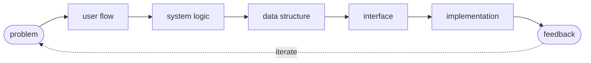

<div align="center">


<a href="https://gianagni.my.id">
  
</a>

**Manajemen Informatika · Politeknik LP3I Jakarta**

<a href="https://gianagni.my.id"></a>
<a href="https://www.linkedin.com/in/USERNAME"></a>
<a href="https://www.instagram.com/USERNAME"></a>

</div>

<br/>

## 🧭 about me

I build web systems, products, and interfaces — usually starting from the **flow**, not the code.
I like turning messy ideas into structured systems, especially projects where the interface is only one part of a bigger system.

> *I don't want to just make a website that works.*
> *I want to understand **why the system should work that way.***

### how i build



<br/>

## 🛠️ things i've built

| | project | what it is |
|:--:|---|---|
| 🎯 | **Lahena** | internship-readiness platform that maps skills → gaps → missions → portfolio |
| 🛒 | **NG Market** | digital service marketplace with checkout, payment flow & account delivery |
| 💸 | **Lummix** | personal finance app concept focused on tracking everyday transactions |
| 🎓 | **Academic Systems** | web-based academic and administrative systems |
| 📒 | **Cash Management** | cash-flow & financial recording system for small businesses |

<br/>

## ⚙️ stack

<p>
  
  <br/>
  
  
</p>

<br/>

## 📍 currently

```yaml
focus:
  - full-stack development
  - system thinking
  - product building
  - learning by shipping

building:
  - Lahena
  - personal projects
  - small experiments

goal:
  - build useful things
  - understand the system behind them
  - keep getting better at both sides: product + code
```

<div align="center">

### `let's build something.`


</div>
