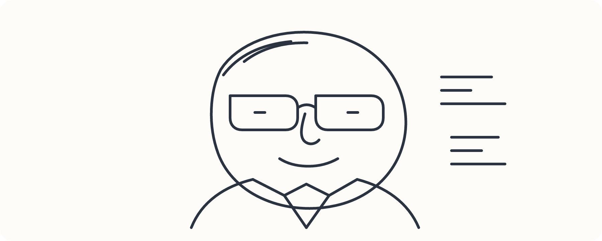
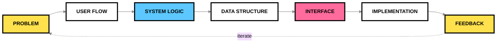

<div align="center">


<br/><br/>

 

<br/><br/>

<a href="https://gianagni.my.id"></a>
<a href="https://www.linkedin.com/in/USERNAME"></a>
<a href="https://www.instagram.com/USERNAME"></a>

</div>

---

## `01` ABOUT ME

**Manajemen Informatika — Politeknik LP3I Jakarta.**
I build web systems, products, and interfaces — usually starting from the **flow**, not the code.
I like turning messy ideas into structured systems, especially projects where the interface is only one part of a bigger system.

> **I don't want to just make a website that works.
> I want to understand why the system should work that way.**

---

## `02` HOW I BUILD



---

## `03` THINGS I'VE BUILT

| # | PROJECT | WHAT IT IS |
|:--:|---|---|
| `01` | **Lahena** | internship-readiness platform that maps skills → gaps → missions → portfolio |
| `02` | **NG Market** | digital service marketplace with checkout, payment flow & account delivery |
| `03` | **Lummix** | personal finance app concept focused on tracking everyday transactions |
| `04` | **Academic Systems** | web-based academic and administrative systems |
| `05` | **Cash Management** | cash-flow & financial recording system for small businesses |

---

## `04` STACK


<br/>


---

## `05` CURRENTLY

```yaml
focus:
  - full-stack development
  - system thinking
  - product building
  - learning by shipping

building:
  - Lahena
  - personal projects
  - small experiments

goal:
  - build useful things
  - understand the system behind them
  - keep getting better at both sides: product + code
```

<br/>

<div align="center">

</div>
